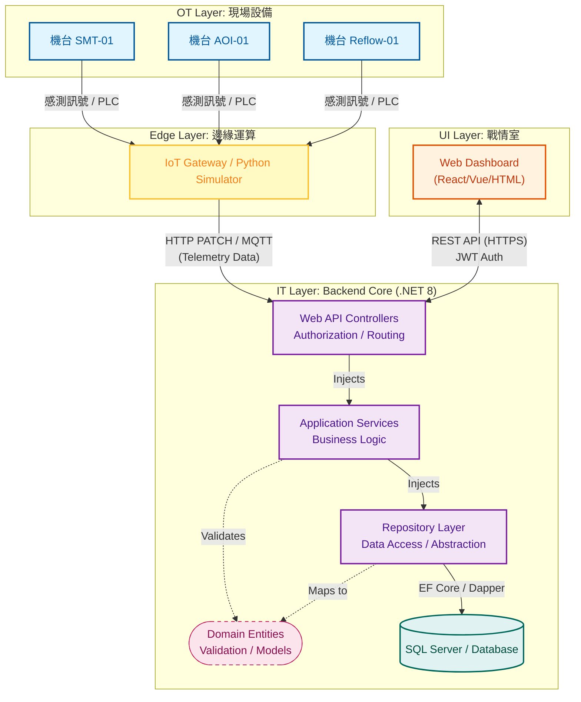

# MES Manufacturing Execution System (C# / .NET 8)

## 專案簡介
這是一個模擬半導體/電子組裝產業的 **製造執行系統 (MES)**。
專案採用 **Agile 敏捷開發** 模式，目前處於 **Sprint 2** 階段。
目標是實現從「設備數據採集」到「戰情室監控」以及「工單管理」的完整流程。

## “功能”
(待補)

## ▶️ 如何執行 (Getting Started)

### 環境需求

* .NET 8 SDK
* SQL Server (Express or LocalDB)
* Python 3.x (僅用於模擬器)

### 1. 資料庫設定
專案附帶 SQL 初始化腳本。
1. 開啟 SQL Server Management Studio (SSMS)。
2. 開啟專案根目錄下的 `MesDb_Script.sql`。
3. 執行腳本，系統將自動建立 `MesDb` 資料庫與所有測試資料。

### 2. 啟動後端

```bash
cd MES_System.WebAPI
dotnet run
# 伺服器將啟動於 http://localhost:5289 (或您的設定 Port)
```

### (可選) 3. 啟動設備模擬器 

```bash
cd Simulator
pip install requests
python app.py
# 模擬器將使用設定的密碼自動登入並向API接口發送機台數據
```

### 4. 訪問前端
用瀏覽器打開 `Dashboard.html`。
* **預設管理員帳號**: `admin`
* **預設密碼**: `admin123`

## 🛠️ 技術棧 (Tech Stack)

| 領域 (Area) | 關鍵技術 (Technologies) |
| --- | --- |
| **Backend** | .NET 8 WebAPI, Entity Framework Core, LINQ |
| **Database** | MSSQL, SSMS |
| **Frontend** | Vanilla JS (ES6+), Chart.js, CSS Variables (Dark Mode) |
| **IoT / Simulation** | Python 3 (Requests, Random) - Digital Twin Simulator |
| **Security & Auth** | JWT (JSON Web Tokens), BCrypt Hashing, Role-Based Access Control (RBAC) |
| **DevOps & QA** | Serilog (Structured Logging), Swagger (OpenAPI), xUnit (TDD), Moq |

---
📂 專案結構 (Project Structure)

遵循**洋蔥式架構**、**Repository Pattern** 與 **Dependency Injection (DI)** 原則：
```
MES_System/
├── MES_System.Domain          # 核心實體 (Equipment, WorkOrder) - 無依賴
├── MES_System.Application     # 應用邏輯 (Interfaces, DTOs, Services)
├── MES_System.Infrastructure  # 實作層 (EF Core DbContext, Repositories, CSV Seeder)
└── MES_System.WebAPI          # 進入點 (Controllers, DI Setup)
```

---
## 系統架構圖 (System Architecture) 📐


## 📅 開發進度
目前用22天完成 **最小可行性產品 (MVP)**，同時會持續優化、擴充功能。
預計優化項目：
*  完善操作介面
* Swagger 註解
* MES 工單過站扣帳、為設備新增站點屬性
* 使用者身分分級
* 檢查文件 - 設備檢。 
* 設備通訊 (MQTT、SECS/GEM、OPC UA、Modbus、I/O/PLC+IoT Gateway)

---
### 📅 Phase 1: 架構基礎與核心 API (Day 1 - Day 5)
**目標：建立符合企業標準的 Clean Architecture (洋蔥架構)。**
* **Day 1**: 專案初始化。建立 `.NET 8 WebAPI`，實作 **Clean Architecture** (Domain, Application, Infrastructure, WebAPI 分層)。
* **Day 2**: 資料庫設計。使用 **Entity Framework Core (EF Core)** 建立 SQL Server 資料庫 (`Equipments` Table)，理解 ORM 運作。
* **Day 3**: 設計模式實作。導入 **Repository Pattern** 與 **Dependency Injection (DI)**，將資料存取與業務邏輯解耦。
* **Day 4**: API 開發與測試。實作 CRUD API，解決 **CORS** 跨域問題，並使用 **Swagger** 進行 API 測試。
* **Day 5**: 專案文件化。撰寫專業的 `README.md`，繪製架構圖，建立 GitHub Repo，確立 **Git Flow** 基礎。

### 📅 Phase 2: 生產業務邏輯與 Web 監控 (Day 6 - Day 10)
**目標：實作核心生產流程與數據視覺化。**
* **Day 6**: 生產資料模組。設計工單 (`WorkOrder`) 資料表與關聯 (`Foreign Key`)，實作複雜的 Entity 關係。
* **Day 7**: 業務邏輯層 (Service Layer)。將商業邏輯從 Controller 抽離至 Service，實作「開工」、「完工」邏輯。
* **Day 8**: 報表與聚合 (Aggregation)。使用 **LINQ** 撰寫複雜查詢，統計 OEE、產量與不良率，提供管理層數據。
* **Day 9**: 前端戰情室 (Dashboard V1)。使用 HTML/CSS/JS 建立即時看板，學習 **Fetch API** 串接後端。
* **Day 10**: 即時監控 (Real-time)。實作前端 **Polling (輪詢)** 機制，讓戰情室數據能自動刷新。

### 📅 Phase 3: 品質維護與測試驅動 (Day 11 - Day 15)
**目標：確保系統穩定性，並加入設備維修流程。**
* **Day 11**: 維修流程設計。繪製 **UML 狀態圖**，定義設備狀態流轉 (Running -> Down -> Repair -> Idle)。
* **Day 12**: 測試驅動開發 (**TDD**)。使用 **xUnit** 與 **Moq**，先寫單元測試再寫程式，確保邏輯正確且防呆。
* **Day 13**: 維修 API 實作。實作維修單 (`MaintenanceRequest`) 的 CRUD，並確保與設備狀態連動。
* **Day 14**: 狀態機邏輯 (State Machine)。完成「報修 -> 維修 -> 完修」的完整閉環邏輯，處理資料一致性。
* **Day 15**: 互動式戰情室。升級 Dashboard，加入互動按鈕 (報修/完修)，直接在網頁上控制後端資料。

###  📅 Phase 4: 資安、DevOps 與數位孿生 (Day 16 - Day 20)
**目標：強化系統安全性、可觀測性，並模擬真實工廠環境。**
* **Day 16**: 資安防護 (**Security**)。實作 **JWT (JSON Web Token)** 驗證，建立使用者資料庫與密碼雜湊 (SHA256)，保護 API。
* **Day 17**: 可觀測性 (**Observability**)。導入 **Serilog** 結構化日誌，實作 **Global Exception Handler**，讓錯誤無所遁形。
* **Day 18**: 數位孿生 (**Digital Twin**)。使用 **Python** 撰寫自動化腳本，模擬機台轉速 (RPM) 與溫度 (Temp) 的波動，並即時回傳給 .NET API。
* **Day 19**: 全端整合與重構。遵循 **DRY 原則**重構前端 JS 代碼，補上 Swagger XML 註解，提升程式碼品質。
* **Day 20**: 模擬部署 (**Deployment**)。使用 `dotnet publish` 打包發布 **Release** 版執行檔，撰寫最終版專案履歷。

### 📅 Phase 5: 桌面端擴充與系統整合 (Day 21 - Day 22)
**目標：開發操作員專用的桌面程式，並優化後端執行模式。**
* **Day 21**: 背景服務化。將 WebAPI 改造為 **System Tray (系統匣)** 程式，支援隱藏視窗與密碼關閉，模擬 Windows Service 行為。
* **Day 22**: WPF 客戶端。建立 **WPF** 桌面應用程式，實作登入視窗、API Service 封裝，以及即時的 DataGrid 數據監控。

---

### 🌟 技術棧 (Tech Stack) 總覽

| 領域 | 使用技術 |
| --- | --- |
| **後端 (Backend)** | C# .NET 8, ASP.NET Core WebAPI, Entity Framework Core |
| **資料庫 (DB)** | SQL Server (MSSQL), LINQ |
| **前端 (Web)** | HTML5, CSS3, JavaScript (ES6+), Chart.js |
| **前端 (Desktop)** | WPF (XAML), HttpClient, System Tray (WinForms) |
| **物聯網 (IoT)** | Python 3 (Requests, Simulation Script) |
| **DevOps & QA** | Git, Swagger (OpenAPI), Serilog, xUnit, JWT |

## 👤 作者 (Author)
蘇政勳 
Owen Su
* GitHub: [https://github.com/OwenSu9527/MES_System.git]
* LinkedIn: []