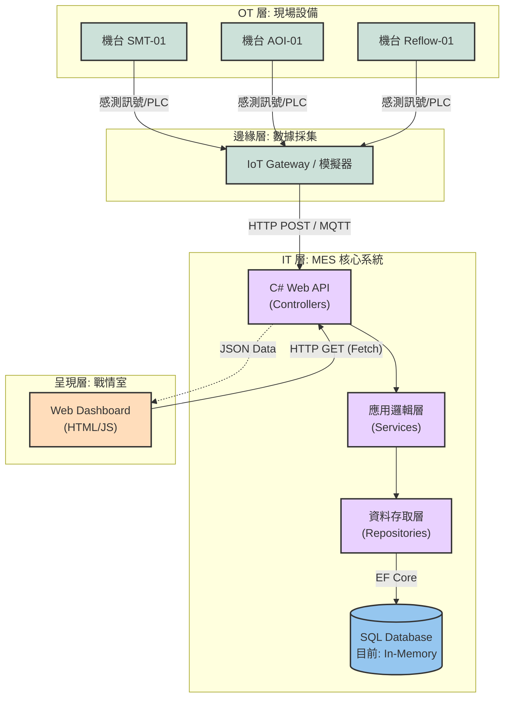

# MES Manufacturing Execution System (C# / .NET 8)

## 專案簡介
這是一個模擬半導體/電子組裝產業的 **製造執行系統 (MES)**。
專案採用 **Agile 敏捷開發** 模式，目前處於 **Sprint 1** 階段。
目標是實現從「設備數據採集」到「戰情室監控」以及「工單管理」的完整流程。

## 🛠 技術堆疊 (Tech Stack)
* **Backend**: C# .NET 8 Web API
* **Architecture**: Onion Architecture (洋蔥式架構)
* **Database**: Entity Framework Core (目前: In-Memory, 預計移轉至 SQL Server)
* **Frontend**: HTML5, CSS3, JavaScript (Fetch API)
* **Tools**: Git, Swagger UI

---

## 系統架構圖 (System Architecture) 📐

---

## 📅 開發進度
### Sprint 1: MVP 基礎建設 (Completed)
- [x] 建立洋蔥式專案架構 (Domain, Application, Infrastructure, WebAPI)
- [x] 定義核心實體：機台 (Equipment) 與狀態枚舉
- [x] 實作 Repository Pattern 與 Dependency Injection
- [x] 開發 RESTful API (GET /api/Equipment)
- [x] 建置即時監控儀表板 (Dashboard)

### Sprint 2: 資料庫與工單系統 (Planned)
- [ ] 遷移至 SQL Server
- [ ] 設計工單 (Work Order) 資料庫 Schema
- [ ] 實作生產回報 API

 ---
